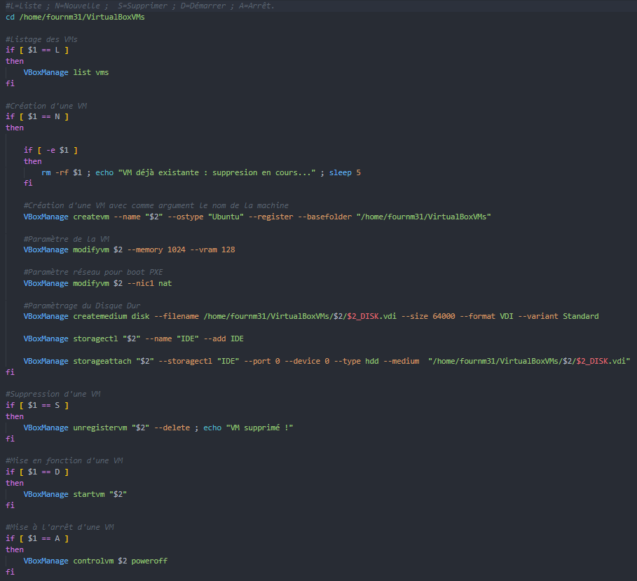

# Script de gestion des machines virtuelles

Date: 17 septembre 2024
Auteurs: Mathéo Fourneaux, Paul Francoise

Ce script shell permet de gérer les machines virtuelles en utilisant la commande VBoxManage fournie par VirtualBox.

## Liste des VMs

Le script vérifie si le premier argument passé est "L" pour lister toutes les machines virtuelles existantes avec la commande `VBoxManage list vms`.

## Création d'une VM

Si le premier argument est "N", le script vérifie si une VM portant le même nom existe déjà. Si c'est le cas, elle est supprimée. Ensuite, une nouvelle machine virtuelle est créée avec le nom spécifié comme deuxième argument. La machine virtuelle utilise le système d'exploitation "Ubuntu". Les paramètres de mémoire et de mémoire vidéo sont configurés à 1024 Mo et 128 Mo respectivement. La machine virtuelle utilise un adaptateur réseau de type NAT pour le démarrage PXE. Un disque dur est également créé avec un nom correspondant à celui de la machine virtuelle et un espace de stockage de 64 000 Mo.

## Suppression d'une VM

Si le premier argument est "S", le script supprime la machine virtuelle spécifiée en utilisant la commande `VBoxManage unregistervm` avec l'option --delete.

## Démarrage d'une VM

Si le premier argument est "D", le script démarre la machine virtuelle spécifiée en utilisant la commande `VBoxManage startvm`.

## Arrêt d'une VM

Si le premier argument est "A", le script met à l'arrêt la machine virtuelle spécifiée en utilisant la commande `VBoxManage controlvm` avec l'option poweroff.
